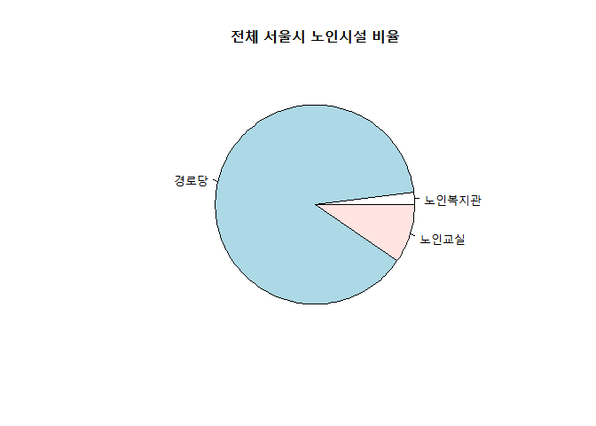
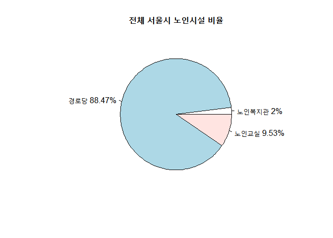
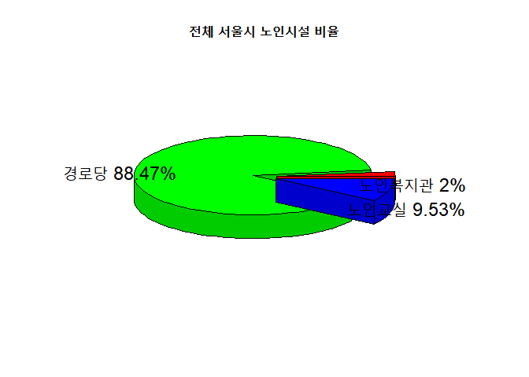
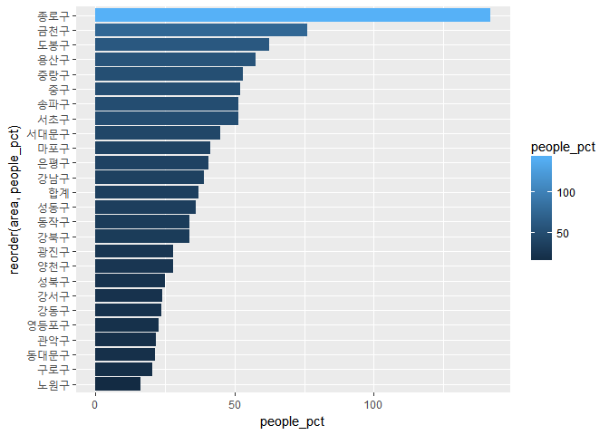
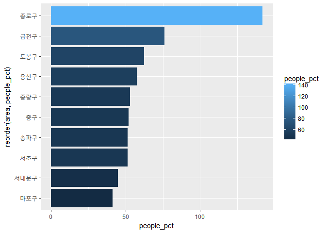
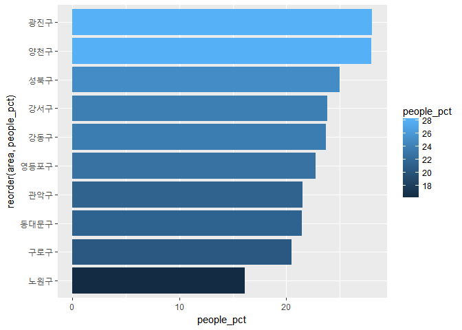

노인여가시설 분석
================

1.데이터 소개
=============

서울은 인구의 15%가 노인일 만큼 고령화가 빠르게 진행되고 있다. 하지만 이 기사에 따르면 노인의 상당수가 갈 곳이 없어 거리로 나오고 있는 실정이라고 한다. 갈 곳이 없어 헤매고 있는 노인들을 위한 노인여가시설의 분포를 분석해 보았다. <http://ch1.tbroad.com/content/view?parent_no=24&content_no=57&p_no=41927>

‘서울시 노인여가 복지시설 (구별) 통계’ 의 데이터를 가지고 분석을 진행했다. 데이터의 출처는 ‘서울특별시 어르신복지과’이고, ‘서울특별시 통계데이터담당관’에서 이 데이터를 담당하고 있다.

2.데이터 분석
=============

패키지 로드
===========

``` r
library(dplyr)
```

    ## Warning: package 'dplyr' was built under R version 3.4.2

    ## 
    ## Attaching package: 'dplyr'

    ## The following objects are masked from 'package:stats':
    ## 
    ##     filter, lag

    ## The following objects are masked from 'package:base':
    ## 
    ##     intersect, setdiff, setequal, union

``` r
library(ggplot2)
```

    ## Warning: package 'ggplot2' was built under R version 3.4.2

``` r
library(readxl)
```

    ## Warning: package 'readxl' was built under R version 3.4.2

데이터 불러오기
===============

``` r
raw<-read_excel("노인여가 복지시설(구별).xls")
```

데이터 파악하기
===============

``` r
data<-raw
dim(data)
```

    ## [1] 28  7

``` r
head(data)
```

    ## # A tibble: 6 x 7
    ##    기간   구분 시설합계 노인복지관 노인복지관__1 경로당 노인교실
    ##   <chr>  <chr>    <chr>      <chr>         <chr>  <chr>    <chr>
    ## 1  기간   구분 시설합계     시설수      종사자수 경로당 노인교실
    ## 2  2016   합계     3808         76          1404   3369      363
    ## 3  2016 종로구       69          2            98     56       11
    ## 4  2016   중구       50          1            26     46        3
    ## 5  2016 용산구      111          2            64     85       24
    ## 6  2016 성동구      172          3            62    154       15

``` r
tail(data)
```

    ## # A tibble: 6 x 7
    ##    기간   구분 시설합계 노인복지관 노인복지관__1 경로당 노인교실
    ##   <chr>  <chr>    <chr>      <chr>         <chr>  <chr>    <chr>
    ## 1  2016 관악구      144          1            31    124       19
    ## 2  2016 서초구      146          3            75    132       11
    ## 3  2016 강남구      193          6            75    164       23
    ## 4  2016 송파구      181          3            93    163       15
    ## 5  2016 강동구      135          2            32    118       15
    ## 6  <NA>   <NA>     <NA>       <NA>          <NA>   <NA>     <NA>

``` r
View(data)
```

데이터 가공하기
===============

``` r
data<-data %>% select(2,3,4,5,6,7)
data<-data[-c(1,28),]
data<-rename(data,종사자수=노인복지관__1,
             지역=구분)
data<-rename(data,area=지역,
             total=시설합계,
             welfare=노인복지관,
             people=종사자수,
             seniorcenter=경로당,
             class=노인교실)
```

변수타입 변환
=============

``` r
str(data)
```

    ## Classes 'tbl_df', 'tbl' and 'data.frame':    26 obs. of  6 variables:
    ##  $ area        : chr  "합계" "종로구" "중구" "용산구" ...
    ##  $ total       : chr  "3808" "69" "50" "111" ...
    ##  $ welfare     : chr  "76" "2" "1" "2" ...
    ##  $ people      : chr  "1404" "98" "26" "64" ...
    ##  $ seniorcenter: chr  "3369" "56" "46" "85" ...
    ##  $ class       : chr  "363" "11" "3" "24" ...

``` r
data$total<-as.numeric(data$total)
data$welfare<-as.numeric(data$welfare)
data$people<-as.numeric(data$people)
data$seniorcenter<-as.numeric(data$seniorcenter)
data$class<-as.numeric(data$class)
str(data)
```

    ## Classes 'tbl_df', 'tbl' and 'data.frame':    26 obs. of  6 variables:
    ##  $ area        : chr  "합계" "종로구" "중구" "용산구" ...
    ##  $ total       : num  3808 69 50 111 172 ...
    ##  $ welfare     : num  76 2 1 2 3 1 1 4 5 2 ...
    ##  $ people      : num  1404 98 26 64 62 ...
    ##  $ seniorcenter: num  3369 56 46 85 154 ...
    ##  $ class       : num  363 11 3 24 15 10 15 8 8 15 ...

``` r
summary(data)
```

    ##      area               total           welfare           people       
    ##  Length:26          Min.   :  50.0   Min.   : 1.000   Min.   :  26.00  
    ##  Class :character   1st Qu.: 120.0   1st Qu.: 2.000   1st Qu.:  42.25  
    ##  Mode  :character   Median : 148.5   Median : 3.000   Median :  55.50  
    ##                     Mean   : 292.9   Mean   : 5.846   Mean   : 108.00  
    ##                     3rd Qu.: 190.0   3rd Qu.: 4.750   3rd Qu.:  70.00  
    ##                     Max.   :3808.0   Max.   :76.000   Max.   :1404.00  
    ##   seniorcenter        class       
    ##  Min.   :  46.0   Min.   :  3.00  
    ##  1st Qu.: 105.2   1st Qu.: 10.25  
    ##  Median : 135.5   Median : 15.00  
    ##  Mean   : 259.2   Mean   : 27.92  
    ##  3rd Qu.: 163.0   3rd Qu.: 19.00  
    ##  Max.   :3369.0   Max.   :363.00

전체 서울시 노인시설 비율
=========================

``` r
pct<-data %>% filter(area=="합계") %>% mutate(welfare_pct=round(welfare/total*100,digits=2),
                                       seniorcenter_pct=round(seniorcenter/total*100,digits=2),
                                       class_pct=round(class/total*100,digits=2)) %>% select(7,8,9)
pct
```

    ## # A tibble: 1 x 3
    ##   welfare_pct seniorcenter_pct class_pct
    ##         <dbl>            <dbl>     <dbl>
    ## 1           2            88.47      9.53

전체 서울시 노인시설 비율-그래프1
---------------------------------

``` r
test <- c(76, 3369, 363)
name <- c("노인복지관","경로당","노인교실")
pie(test, labels = name, main = "전체 서울시 노인시설 비율")
```



전체 서울시 노인시설 비율-그래프2
---------------------------------

``` r
percent <- round(test/sum(test) * 100,digits=2)
percent <- paste(percent, "%", sep="")
name2 <- paste(name, percent)
pie(test, labels = name2, main = "전체 서울시 노인시설 비율")
```



전체 서울시 노인시설 비율-그래프3
---------------------------------

``` r
library(plotrix)
```

    ## Warning: package 'plotrix' was built under R version 3.4.3

``` r
test
```

    ## [1]   76 3369  363

``` r
name
```

    ## [1] "노인복지관" "경로당"     "노인교실"

``` r
pie3D(test, labels = name, explode = 0.1, main = "전체 서울시 노인시설 비율")
```


전체 서울시 노인시설 비율-그래프4
---------------------------------

``` r
pie3D(test, labels = name2, explode = 0.1, main = "전체 서울시 노인시설 비율")
```



서울시의 전체 노인 시설 가운데 경로당 비율은 88.47%를 차지해 가장 높았다. 노인복지관은 2%, 노인교실은 9.53%에 불과하다. 그렇다면 가장 높은 비율을 차지하는 경로당은 구 별로 다르게 분포되어 있을까?

구별 시설 수 비교
=================

``` r
data2<-data[-c(1),]
data_total<-data2 %>% arrange(desc(total)) %>% 
  select(1,2)
data_total
```

    ## # A tibble: 25 x 2
    ##        area total
    ##       <chr> <dbl>
    ##  1   노원구   260
    ##  2   강서구   239
    ##  3   구로구   210
    ##  4 영등포구   202
    ##  5   양천구   193
    ##  6   강남구   193
    ##  7   송파구   181
    ##  8   성동구   172
    ##  9   성북구   172
    ## 10   은평구   170
    ## # ... with 15 more rows

우선 노인 여가시설의 수는 노원구가 가장 많았으며, 강서구, 구로구 순으로 이어졌다.

구별 여가시설 비율
==================

``` r
area_total<-data2 %>% group_by(area) %>% 
  mutate(t_pct=round(total/3808*100,digits=2)) %>% 
  arrange(desc(t_pct)) %>% select(area,t_pct)
area_total
```

    ## # A tibble: 25 x 2
    ## # Groups:   area [25]
    ##        area t_pct
    ##       <chr> <dbl>
    ##  1   노원구  6.83
    ##  2   강서구  6.28
    ##  3   구로구  5.51
    ##  4 영등포구  5.30
    ##  5   양천구  5.07
    ##  6   강남구  5.07
    ##  7   송파구  4.75
    ##  8   성동구  4.52
    ##  9   성북구  4.52
    ## 10   은평구  4.46
    ## # ... with 15 more rows

이를 비율로 나타내면 서울시 내의 노인 시설 분포비율을 구 별로 비교해 볼 수 있다. 이번엔 경로당 비율을 비교해보자.

구별 경로당 비율
================

``` r
area_center<-data2 %>% group_by(area) %>% 
  mutate(s_pct=round(seniorcenter/3369*100,digits=2)) %>% 
  arrange(desc(s_pct)) %>% select(area,s_pct)
area_center
```

    ## # A tibble: 25 x 2
    ## # Groups:   area [25]
    ##        area s_pct
    ##       <chr> <dbl>
    ##  1   노원구  7.24
    ##  2   강서구  6.32
    ##  3   구로구  5.61
    ##  4 영등포구  5.14
    ##  5   강남구  4.87
    ##  6   양천구  4.84
    ##  7   송파구  4.84
    ##  8   성북구  4.72
    ##  9   성동구  4.57
    ## 10   마포구  4.45
    ## # ... with 15 more rows

경로당 비율 또한 노원구, 강서구, 구로구 순으로 비슷하게 분포되어 있다.

다음으로는 서울 시 내에서 구별 경로당의 비율이 아닌, 구별 노인여가시설 중 경로당의 비율을 살펴보았다.

구별 노인여가시설 중 경로당 비율
================================

``` r
seniorcenter_percent<-data %>% group_by(area) %>% 
  mutate(seniorcenter_pct=round(seniorcenter/total*100,2)) %>% 
  arrange(desc(seniorcenter_pct)) %>% select(area,seniorcenter_pct)
View(seniorcenter_percent)

seniorcenter_percent %>% filter(area=="합계")
```

    ## # A tibble: 1 x 2
    ## # Groups:   area [1]
    ##    area seniorcenter_pct
    ##   <chr>            <dbl>
    ## 1  합계            88.47

노원구의 경로당이 노원구의 노인 시설 중에 93.85%의 비율로 가장 많은 시설에 속해있으며, 도봉구는 93.15%, 성북구는 92.44%로 그 뒤를 이었다. 이는 서울시 전체 경로당의 평균 비율인 88.47%보다 높은 비율이었다.

그 반면 용산구는 76.58%로 노인 시설 중 경로당의 비율이 가장 낮았다.

구별 노인여가시설과 종사자 비율(합계 행의 비율 = 평균비율)
==========================================================

``` r
people_pct<-data %>% group_by(area) %>% 
  mutate(people_pct=round(people/total*100,2)) %>% 
  arrange(desc(people_pct)) %>% select(area,people_pct)

View(people_pct)
```

하지만 노원구는 노인 시설에 비하면 종사자의 비율이 가장 낮은결과를 보였다.

구별 노인여가시설과 종사자 비율-그래프
======================================

``` r
ggplot(data=people_pct, aes(x=reorder(area,people_pct),y=people_pct,fill=people_pct))+geom_col()+coord_flip()
```



상위10
------

``` r
people_top10<-data %>% group_by(area) %>% 
  mutate(people_pct=round(people/total*100,2)) %>% 
  arrange(desc(people_pct)) %>% select(area,people_pct) %>% head(10)
people_top10
```

    ## # A tibble: 10 x 2
    ## # Groups:   area [10]
    ##        area people_pct
    ##       <chr>      <dbl>
    ##  1   종로구     142.03
    ##  2   금천구      76.25
    ##  3   도봉구      62.33
    ##  4   용산구      57.66
    ##  5   중랑구      53.03
    ##  6     중구      52.00
    ##  7   송파구      51.38
    ##  8   서초구      51.37
    ##  9 서대문구      44.83
    ## 10   마포구      41.18

상위10-그래프
-------------

``` r
ggplot(data=people_top10, aes(x=reorder(area,people_pct),y=people_pct,fill=people_pct))+geom_col()+coord_flip()
```



하위10
------

``` r
people_bottom10<-data %>% group_by(area) %>% 
  mutate(people_pct=round(people/total*100,2)) %>% 
  arrange(people_pct) %>% select(area,people_pct) %>% head(10)
people_bottom10
```

    ## # A tibble: 10 x 2
    ## # Groups:   area [10]
    ##        area people_pct
    ##       <chr>      <dbl>
    ##  1   노원구      16.15
    ##  2   구로구      20.48
    ##  3 동대문구      21.48
    ##  4   관악구      21.53
    ##  5 영등포구      22.77
    ##  6   강동구      23.70
    ##  7   강서구      23.85
    ##  8   성북구      25.00
    ##  9   양천구      27.98
    ## 10   광진구      28.04

하위10-그래프
-------------

``` r
ggplot(data=people_bottom10, aes(x=reorder(area,people_pct),y=people_pct,fill=people_pct))+geom_col()+coord_flip()
```


